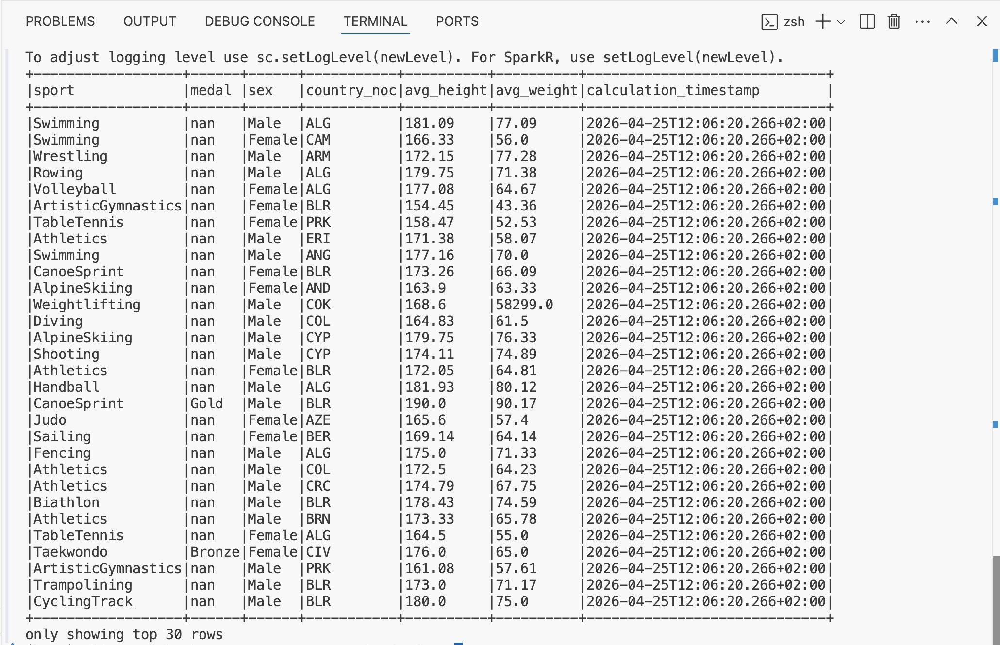
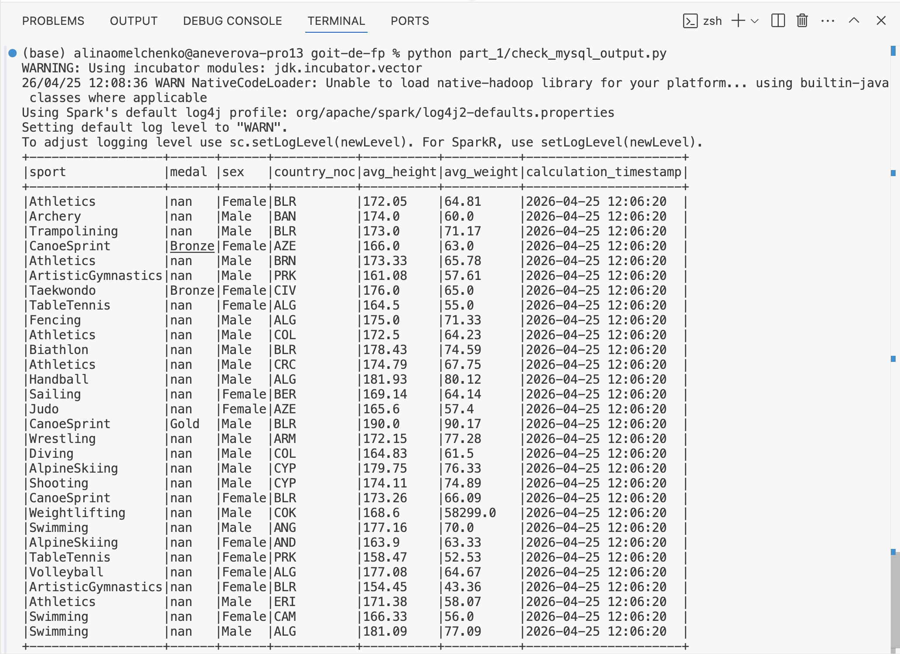
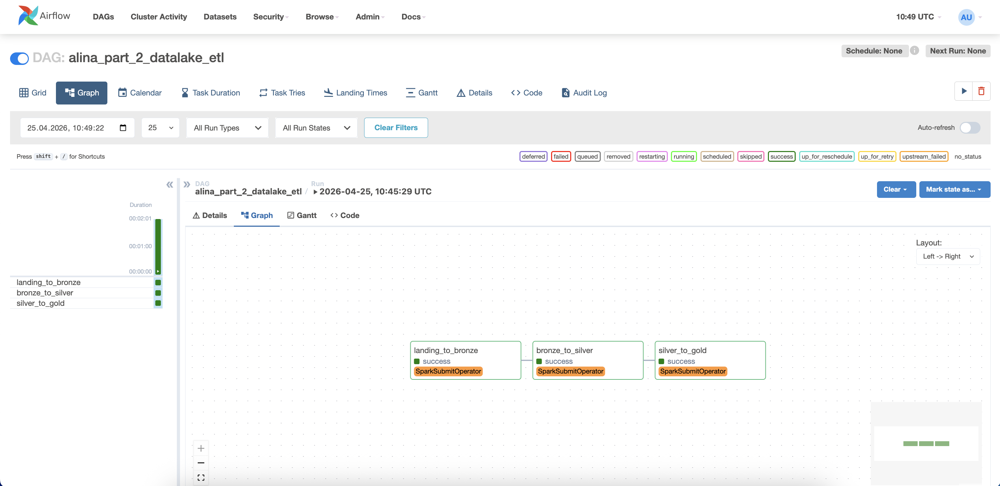
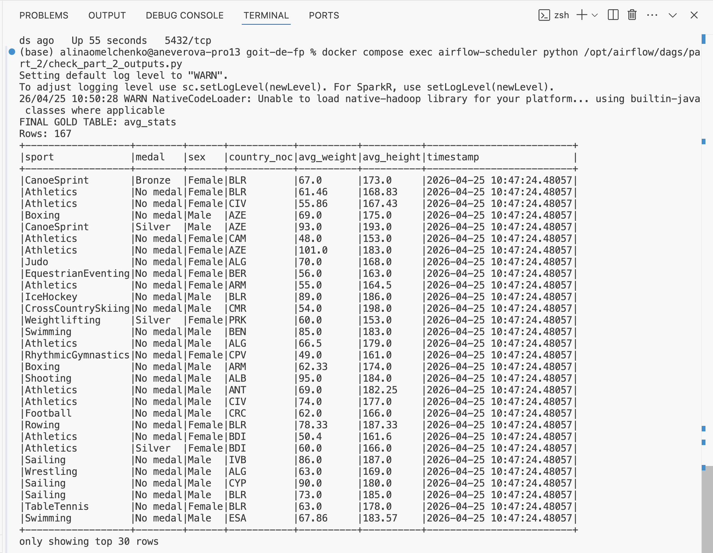
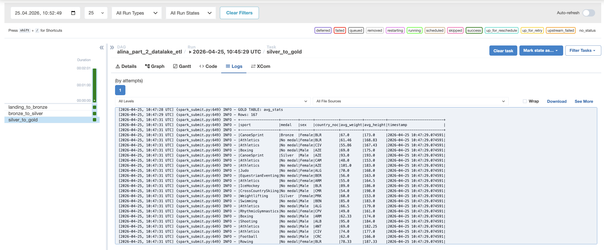

## Частина 1. End-to-End Streaming Pipeline

У першій частині проєкту я реалізувала стримінговий пайплайн для обробки даних атлетів.

Дані з таблиці `athlete_event_results` були зчитані з MySQL та записані у Kafka топік.  
Після цього Spark Streaming зчитав дані з Kafka, перетворив JSON у DataFrame та об'єднав їх з біологічними даними атлетів з таблиці `athlete_bio`.

У пайплайні було виконано фільтрацію некоректних значень зросту та ваги, після чого розраховано середній зріст і вагу атлетів за видом спорту, медаллю, статтю та країною.

Результат був записаний у два джерела за допомогою `foreachBatch`:
- вихідний Kafka-топік
- таблицю MySQL

### Результат у Kafka

На скриншоті видно дані, зчитані з вихідного Kafka-топіка після обробки.

### Результат у MySQL

На скриншоті видно дані, які були записані в таблицю MySQL після виконання стримінгового пайплайну.

### Висновок
У результаті було побудовано повний стримінговий пайплайн, який зчитує дані з MySQL і Kafka, об'єднує їх, виконує агрегацію та записує фінальний результат назад у Kafka і MySQL.

## Частина 2. End-to-End Batch Data Lake

У другій частині проєкту я реалізувала batch data lake з трьома рівнями обробки даних - bronze, silver і gold.

На першому етапі CSV файли `athlete_bio` та `athlete_event_results` були завантажені з FTP сервера та збережені у форматі parquet у bronze layer.

На другому етапі дані з bronze layer були очищені - для текстових колонок застосовано функцію очищення, а дублікати рядків були видалені.

На третьому етапі дані з silver layer були об'єднані за `athlete_id`, після чого було розраховано середню вагу та зріст атлетів для кожної комбінації `sport`, `medal`, `sex` і `country_noc`.

Усі етапи були автоматизовані через Airflow DAG, який послідовно запускає три Spark jobs.

### Успішне виконання DAG

На скриншоті видно, що всі три задачі DAG успішно виконались.

### Результат у gold layer

На скриншоті видно фінальну таблицю `avg_stats`, яка була збережена в gold layer.

### Логи задачі silver_to_gold

На скриншоті видно лог останньої Spark job, де виведено фінальний результат агрегації.

### Висновок
У результаті було побудовано batch data lake, який завантажує сирі CSV-дані, зберігає їх у bronze layer, очищує у silver layer та формує фінальний аналітичний датасет у gold layer.